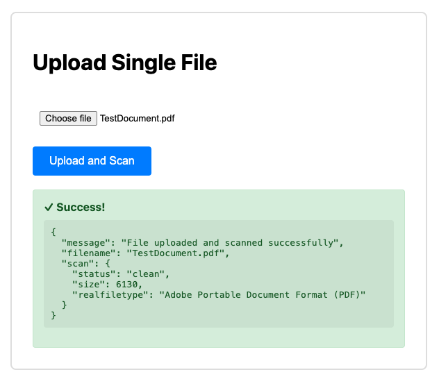
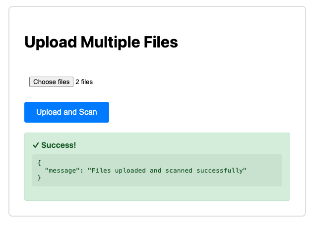

# attachmentAV Express.js Middleware Example

A complete example demonstrating how to integrate the [attachmentAV API](https://attachmentav.com/solution/virus-malware-scan-api/) minto an Express.js application to scan file uploads for malware.

This example shows how to scan uploaded files for viruses using the attachmentAV API before processing them, supporting both single and multiple file uploads.

## Features

- Single file upload with malware scanning
- Multiple file upload with concurrent malware scanning
- Rate limiting for API calls to avoid throttling
- In-memory file processing with Multer
- Clean, interactive web interface with real-time feedback

## Prerequisites

- Node.js 18+ (for native fetch API support)
- An attachmentAV API key ([Sign up here](https://attachmentav.com/subscribe/api/))

## Installation

1. Clone this repository:
```bash
git clone https://github.com/widdix/attachmentav-example-nodejs-express-middleware.git
cd attachmentav-example-nodejs-express-middleware.
```

2. Install dependencies:
```bash
npm install
```

## Usage

1. Start the server:
```bash
ATTACHMENTAV_API_KEY="your-api-key-here" npm run serve
```

2. Open your browser and navigate to:
```
http://localhost:3000
```

3. Upload a file using either form:
   - **Single file upload**: Select one file and click "Upload and Scan"
   - **Multiple files upload**: Select multiple files and click "Upload and Scan"

## How It Works

### Single File Upload (`/upload`)

Code: https://github.com/widdix/attachmentav-example-nodejs-express-middleware/blob/main/index.js#L38-L67

1. User selects a file through the web interface
2. Multer middleware processes the multipart/form-data request
3. File is stored in memory (not on disk)
4. File buffer is sent to attachmentAV API for scanning
5. Response handling:
   - If malware detected → Returns 400 error with details
   - If scan fails → Returns 500 error
   - If clean → Returns 200 success with scan results



### Multiple File Upload (`/multi-upload`)

Code: https://github.com/widdix/attachmentav-example-nodejs-express-middleware/blob/main/index.js#L69-L102

1. User selects multiple files
2. Files are processed concurrently with rate limiting (max 3 concurrent requests)
3. Each file is scanned independently
4. If any file contains malware → Entire upload is rejected
5. All files must be clean for success response



### Rate Limiting

The example uses [`p-limit`](https://www.npmjs.com/package/p-limit) to limit concurrent attachmentAV API requests to 3, preventing API throttling when uploading multiple files.

## API Endpoints

### POST `/upload`
Uploads and scans a single file.

**Request:**
- Content-Type: `multipart/form-data`
- Field name: `file`

**Success Response (200):**
```json
{
  "message": "File uploaded and scanned successfully",
  "filename": "example.pdf",
  "scan": {
    "status": "clean",
    "hash": "...",
    "scan_time": 0.123
  }
}
```

**Error Response (400 - Malware Detected):**
```json
{
  "error": "Malware detected",
  "details": {
    "status": "infected",
    "viruses": ["EICAR-Test-File"],
    "hash": "..."
  }
}
```

### POST `/multi-upload`
Uploads and scans multiple files.

**Request:**
- Content-Type: `multipart/form-data`
- Field name: `files` (multiple files)

**Success Response (200):**
```json
{
  "message": "Files uploaded and scanned successfully"
}
```

**Error Response (400 - Malware Detected):**
```json
{
  "error": "Malware detected",
  "details": {
    "status": "infected",
    "viruses": ["EICAR-Test-File"],
    "hash": "..."
  }
}
```

## Configuration

### attachmentAV Region

The example uses the EU endpoint by default:
```javascript
const ATTACHMENTAV_URL = 'https://eu.developer.attachmentav.com/v1/scan/sync/binary';
```

Available regions:
- EU: `https://eu.developer.attachmentav.com/v1/scan/sync/binary`
- US: `https://us.developer.attachmentav.com/v1/scan/sync/binary`
- Canada: `https://canada.developer.attachmentav.com/v1/scan/sync/binary`
- India: `https://india.developer.attachmentav.com/v1/scan/sync/binary`

Change the `ATTACHMENTAV_URL` constant in `index.js` to use a different region.

### File Size Limits

attachmentAV allows files up to 10MB for the `/v1/scan/sync/binary` endpoint.
You can configure a custom file size limit when initializing `multer` in [`index.js`](./index.js):

```javascript
const upload = multer({
  storage: multer.memoryStorage(),
  limits: {
    fileSize: 10 * 1024 * 1024 // 10MB limit
  }
});
```

If you need to scan files larger than 10MB, consider using a different endpoint:
- `/v1/scan/sync/download` for scanning files up to 200MB from a URL -> requires additional setup to provide the uploaded file to attachmentAV, e.g. using a presigned URL
- `/v1/scan/async/download` for scanning files up to 5GB in the background -> requires additional setup to process the callback response

### Concurrent Scan Limit

Adjust the concurrent scan limit in the multi-upload endpoint:

```javascript
const limit = pLimit(3); // Change to desired concurrency
```

## Security Considerations

1. **File Size Limits**: Consider adding file size limits to prevent memory exhaustion
2. **File Type Validation**: Add file type validation based on your use case
3. **Rate Limiting**: Implement rate limiting for uploads to prevent abuse
4. **Authentication**: Add authentication before allowing file uploads
5. **HTTPS**: Use HTTPS in production to protect API keys and data in transit
6. **Error Information**: Limit error details exposed to clients in production

## Project Structure

```
.
├── index.js              # Express server with upload endpoints
├── package.json          # Dependencies and scripts
├── public/
│   └── index.html        # Upload interface with JavaScript
└── README.md            # This file
```

## Dependencies

- **express** (^5.2.1): Web framework
- **multer** (^2.0.2): Multipart/form-data handling for file uploads
- **p-limit** (^7.2.0): Rate limiting for concurrent API requests

## Testing Malware Detection

To test malware detection, you can use the [EICAR test file](https://www.eicar.org/download-anti-malware-testfile/), which is a standard test file recognized by all antivirus software.

## License

MIT

## Resources

- [attachmentAV Documentation](https://attachmentav.com/help/virus-malware-scan-api/)
- [attachmentAV API Reference](https://attachmentav.com/help/virus-malware-scan-api/developer/definition.html)
- [Express.js Documentation](https://expressjs.com/)
- [Multer Documentation](https://github.com/expressjs/multer)
